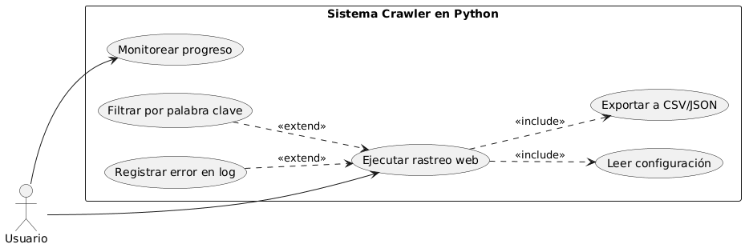
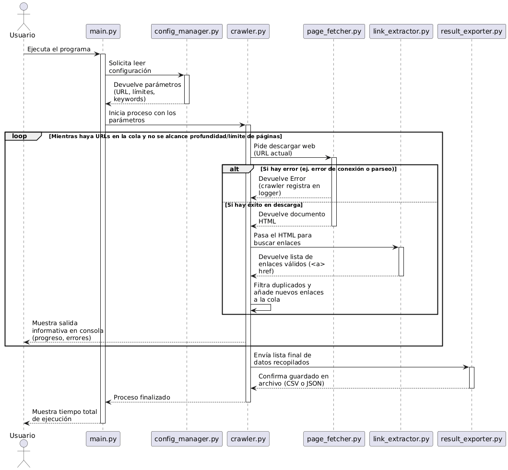

# Crawler_Python

Este proyecto consiste en el desarrollo de un crawler modular diseñado para recorrer automáticamente un conjunto de páginas web, extrayendo información relevante de manera estructurada. El sistema permite configurar límites de profundidad, palabras clave y formatos de salida, garantizando un rastreo eficiente y controlado.

## Estructura del Proyecto

El código se organiza siguiendo los principios de responsabilidad única y modularidad recomendados en la práctica:

```text
Crawler_Python/
│
├── docs/                        # Documentación técnica
│   ├── uml/                     # Archivos fuente PlantUML
│   └── img/                     # Imágenes de los diagramas
│
├── src/                         # Código fuente
│   ├── crawler/                 # Paquete principal
│   │   ├── __init__.py          
│   │   ├── crawler.py           # Cerebro del sistema (Búsqueda en Anchura)
│   │   ├── page_fetcher.py      # Descarga y parseo (requests + BeautifulSoup)
│   │   ├── link_extractor.py    # Normalización y filtrado de enlaces
│   │   ├── result_exporter.py   # Exportación flexible a CSV/JSON
│   │   ├── config_manager.py    # Lector de configuración con validación estricta
│   │   └── logger_util.py       # Sistema de logs con doble salida
│   └── main.py                  # Orquestador del programa
│
├── config.ini                   # Parámetros del usuario
├── errores.log                  # Registro persistente de fallos
├── requirements.txt             # Dependencias (requests, beautifulsoup4)
└── README.md                    # Documentación del proyecto
```

## Motor del Crawler (crawler.py)

El núcleo del sistema actúa como el director de orquesta y utiliza un algoritmo de Búsqueda en Anchura (BFS) implementado con collections.deque. Esta decisión garantiza que el rastreo sea ordenado: explora completamente un nivel de profundidad antes de descender al siguiente.

Características clave del motor:

1. Control de Profundidad estricto: La cola de navegación asocia cada URL con su nivel de profundidad actual, cortando la rama si supera el límite configurado (Mínimo 3).
2. Límite de Páginas: El bucle se detiene inmediatamente al alcanzar el máximo (Mínimo 50), ahorrando recursos.
3. Limpieza Avanzada de Datos: Se emplea el patrón `" ".join(texto.split())` para purgar saltos de línea (`\n`) y tabulaciones ocultas en el código HTML de los títulos, garantizando una exportación inmaculada.
4. Medición de Rendimiento: Calcula el tiempo de descarga y parseo de cada página en milisegundos (ms).

## Decisiones de Diseño

Se detallan las decisiones técnicas tomadas para garantizar la robustez del sistema:

### 1. Gestión de Logs con Doble Salida
Se utiliza la librería nativa logging con dos controladores diferenciados:

- Consola (Nivel INFO): Permite al usuario monitorear el progreso del rastreo en tiempo real, indicando el nivel de profundidad actual, el tiempo de descarga y la URL.
- Archivo errores.log (Nivel ERROR): Registra de forma persistente los fallos de red o parseo, incluyendo marca de tiempo y detalle del error.

### 2. Validación de Configuración mediante Excepciones (raise)
En lugar de forzar el cierre del programa desde el módulo de configuración, config_manager.py lanza excepciones de tipo ValueError o FileNotFoundError. Esto desacopla el lector del flujo principal; es main.py quien captura las excepciones y realiza un cierre limpio sin mostrar tracebacks confusos.

### 3. Normalización y Filtrado de Enlaces
Para evitar bucles infinitos y fugas a otras webs, el extractor:

- Usa urllib.parse.urljoin para convertir enlaces relativos (/contacto) en absolutos.
- Restringe la navegación al mismo dominio de la URL inicial.
- Utiliza una estructura de datos set (conjuntos) para el control de duplicados, reduciendo la complejidad temporal de búsqueda a O(1).

### 4. Exportación Multiformato Segura
El módulo unifica la generación de resultados para CSV y JSON. Está protegido mediante bloques try...except contra fallos del sistema operativo (OSError), como falta de permisos o espacio en disco en el momento del guardado.

## Diagramas UML
En la carpeta docs/ se encuentran dos diagramas fundamentales para entender el sistema:

- Diagrama de Casos de Uso: Muestra las funciones que el usuario puede realizar y las dependencias internas (include y extend).

- Diagrama de Secuencia: Describe cómo fluyen los datos entre los archivos .py desde que se arranca el programa hasta que se genera el archivo de resultados.



## Instalación y Uso

1. Clonar el repositorio: `git clone https://github.com/ignaciodc/Crawler_Python`
2. Instalar el entorno virtual y dependencias: `pip install -r requirements.txt`
3. Ajustar los parámetros en el archivo config.ini.
4. Ejecutar el rastreador:
```bash
python src/main.py
```